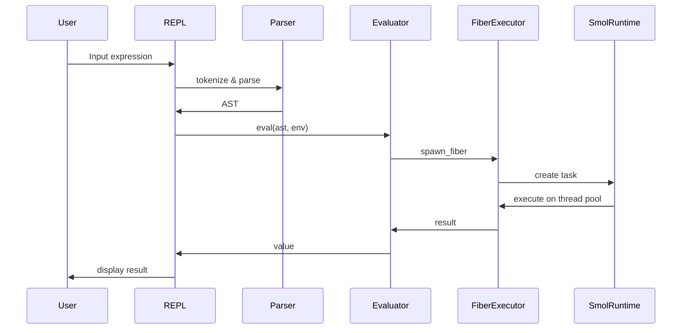
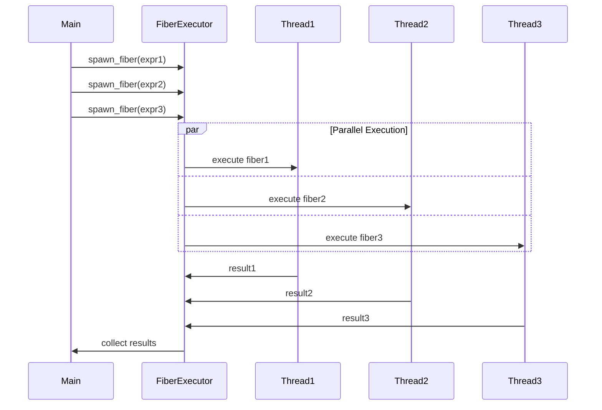
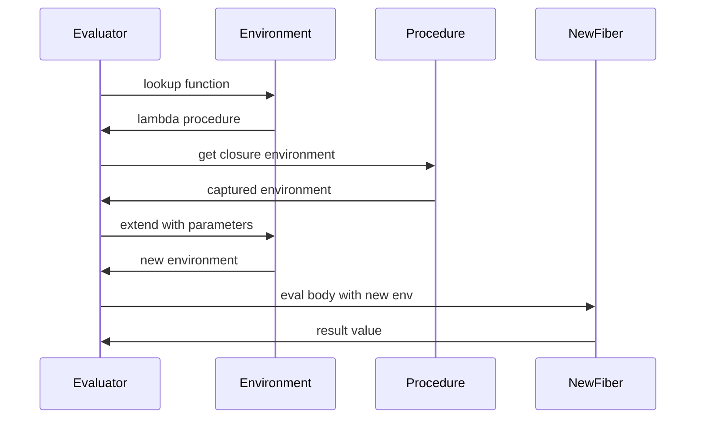

# Twine Scheme Interpreter - Technical Design Document

## Table of Contents

1. [System Overview](#system-overview)
2. [Architecture](#architecture)
3. [Core Components](#core-components)
4. [Concurrency Model](#concurrency-model)
5. [Data Types and Memory Management](#data-types-and-memory-management)
6. [Execution Engine](#execution-engine)
7. [Asynchronous I/O](#asynchronous-io)
8. [Error Handling](#error-handling)
9. [Sequence Diagrams](#sequence-diagrams)
10. [Implementation Considerations](#implementation-considerations)
11. [Performance Characteristics](#performance-characteristics)
12. [Security Considerations](#security-considerations)

## System Overview

Twine is a purely functional Scheme interpreter written in Rust that emphasizes immutability, asynchronous I/O, and parallel execution. The system is built around three core principles:

1. **Complete Immutability**: All data structures are immutable after creation
2. **Fiber-based Concurrency**: Lightweight tasks executed on a thread pool using `smol` async runtime
3. **Minimal Implementation**: Essential R7RS-small subset for simplicity and maintainability

### Key Design Decisions

- **Runtime**: `smol` async runtime for lightweight, efficient concurrency
- **Concurrency Model**: Fiber-based parallelism without Global Interpreter Lock (GIL)
- **Memory Management**: Rust's ownership system + reference counting for shared immutable data
- **Thread Pool**: Multi-threaded execution pool managed by `smol`
- **Error Handling**: Result-based error propagation with async-compatible patterns

## Architecture

### High-Level System Architecture

```
┌─────────────────────────────────────────────────────────────────┐
│                        User Interface Layer                     │
├─────────────────────────────────────────────────────────────────┤
│  REPL Interface  │           File Execution                     │
├─────────────────────────────────────────────────────────────────┤
│                     Interpreter Core                            │
├─────────────────────────────────────────────────────────────────┤
│   Parser    │    Evaluator    │    Environment Manager          │
├─────────────────────────────────────────────────────────────────┤
│                   Fiber Execution Engine                        │
├─────────────────────────────────────────────────────────────────┤
│              Smol Async Runtime + Thread Pool                   │
├─────────────────────────────────────────────────────────────────┤
│        Immutable Data Types    │    Built-in Procedures         │
└─────────────────────────────────────────────────────────────────┘
```

### Module Structure

```
twine/
├── src/
│   ├── main.rs              # Entry point and CLI
│   ├── lib.rs               # Library root
│   ├── lexer/
│   │   ├── mod.rs           # Tokenization
│   │   └── token.rs         # Token definitions
│   ├── parser/
│   │   ├── mod.rs           # S-expression parsing
│   │   └── ast.rs           # Abstract syntax tree
│   ├── interpreter/
│   │   ├── mod.rs           # Evaluation engine
│   │   ├── environment.rs   # Variable binding
│   │   ├── procedures.rs    # Built-in functions
│   │   └── fiber.rs         # Fiber management
│   ├── types/
│   │   ├── mod.rs           # Core data types
│   │   ├── value.rs         # Scheme values
│   │   └── immutable.rs     # Immutable collections
│   ├── runtime/
│   │   ├── mod.rs           # Async runtime management
│   │   ├── executor.rs      # Fiber executor
│   │   └── io.rs            # Async I/O operations
│   ├── repl/
│   │   ├── mod.rs           # REPL implementation
│   │   └── prompt.rs        # User interaction
│   └── error/
│       ├── mod.rs           # Error types
│       └── reporting.rs     # Error formatting
```

## Core Components

### 1. Lexer (`lexer/`)

**Responsibility**: Convert source code into tokens

```rust
pub enum Token {
    LeftParen,
    RightParen,
    Quote,
    Number(f64),
    String(String),
    Symbol(String),
    Boolean(bool),
    EOF,
}

pub struct Lexer {
    input: String,
    position: usize,
    line: usize,
    column: usize,
}
```

**Key Features**:
- Line/column tracking for error reporting
- Comment handling (semicolon to end-of-line)
- Proper number parsing (integers and floats)
- String literal parsing with escape sequences

### 2. Parser (`parser/`)

**Responsibility**: Convert tokens into Abstract Syntax Tree

```rust
#[derive(Debug, Clone)]
pub enum Expr {
    Atom(Value),
    List(Vec<Expr>),
    Quote(Box<Expr>),
}

pub struct Parser {
    tokens: Vec<Token>,
    current: usize,
}
```

**Key Features**:
- S-expression parsing with proper nesting
- Quote syntax handling
- Syntax error detection and reporting
- AST construction for efficient evaluation

### 3. Value System (`types/`)

**Responsibility**: Immutable data type representation

```rust
#[derive(Debug, Clone)]
pub enum Value {
    Number(f64),
    Boolean(bool),
    String(Arc<str>),
    Symbol(Arc<str>),
    List(Arc<[Value]>),
    Procedure(Arc<Procedure>),
    Nil,
}

#[derive(Debug)]
pub enum Procedure {
    Builtin {
        name: String,
        func: fn(&[Value]) -> Result<Value, Error>,
    },
    Lambda {
        params: Vec<String>,
        body: Expr,
        closure: Environment,
    },
}
```

**Key Features**:
- All values are immutable after creation
- Reference counting (`Arc`) for memory efficiency
- Built-in and user-defined procedure support
- Proper list representation (proper/improper)

### 4. Environment Management (`interpreter/environment.rs`)

**Responsibility**: Variable binding and lexical scoping

```rust
#[derive(Debug, Clone)]
pub struct Environment {
    bindings: Arc<HashMap<String, Value>>,
    parent: Option<Arc<Environment>>,
}

impl Environment {
    pub fn new() -> Self { /* ... */ }
    pub fn with_parent(parent: Arc<Environment>) -> Self { /* ... */ }
    pub fn define(&mut self, name: String, value: Value) { /* ... */ }
    pub fn lookup(&self, name: &str) -> Option<Value> { /* ... */ }
    pub fn extend(&self, params: &[String], args: &[Value]) -> Environment { /* ... */ }
}
```

**Key Features**:
- Immutable environment chains
- Lexical scoping implementation
- Closure capture support
- Thread-safe sharing via `Arc`

### 5. Fiber Execution Engine (`runtime/`)

**Responsibility**: Manage parallel execution of Scheme computations

```rust
pub struct Fiber {
    id: FiberId,
    task: Pin<Box<dyn Future<Output = Result<Value, Error>> + Send>>,
}

pub struct FiberExecutor {
    runtime: smol::Executor<'static>,
    thread_pool: Vec<std::thread::JoinHandle<()>>,
}

impl FiberExecutor {
    pub fn new(thread_count: usize) -> Self { /* ... */ }
    pub async fn spawn_fiber(&self, expr: Expr, env: Environment) -> FiberId { /* ... */ }
    pub async fn await_fiber(&self, id: FiberId) -> Result<Value, Error> { /* ... */ }
    pub fn shutdown(self) { /* ... */ }
}
```

**Key Features**:
- Lightweight fiber creation and management
- Thread pool for parallel execution
- No GIL - true parallelism
- Async-compatible with `smol` runtime

## Concurrency Model

### Fiber Architecture

The concurrency model is built around fibers (lightweight tasks) that execute on a thread pool managed by the `smol` async runtime:

```
┌─────────────────────────────────────────────────────────────┐
│                    Smol Async Runtime                       │
├─────────────────────────────────────────────────────────────┤
│  Thread 1    │  Thread 2    │  Thread 3    │  Thread 4    │
├─────────────────────────────────────────────────────────────┤
│ Fiber Pool   │ Fiber Pool   │ Fiber Pool   │ Fiber Pool   │
│  ┌─────┐     │  ┌─────┐     │  ┌─────┐     │  ┌─────┐     │
│  │Fiber│     │  │Fiber│     │  │Fiber│     │  │Fiber│     │
│  │ A   │     │  │ C   │     │  │ E   │     │  │ G   │     │
│  └─────┘     │  └─────┘     │  └─────┘     │  └─────┘     │
│  ┌─────┐     │  ┌─────┐     │  ┌─────┐     │  ┌─────┐     │
│  │Fiber│     │  │Fiber│     │  │Fiber│     │  │Fiber│     │
│  │ B   │     │  │ D   │     │  │ F   │     │  │ H   │     │
│  └─────┘     │  └─────┘     │  └─────┘     │  └─────┘     │
└─────────────────────────────────────────────────────────────┘
```

### Fiber Lifecycle

1. **Creation**: Fibers are spawned from Scheme expressions
2. **Scheduling**: `smol` executor distributes fibers across threads
3. **Execution**: Independent evaluation with immutable data sharing
4. **Synchronization**: Fibers can await other fibers for coordination
5. **Completion**: Results are collected and returned to caller

### Thread Safety

- **Immutable Data**: All Scheme values are immutable, enabling safe sharing
- **Arc-based Sharing**: Reference counting for memory management
- **No Locks**: Immutability eliminates need for mutexes or locks
- **Message Passing**: Fibers communicate through immutable value passing

## Data Types and Memory Management

### Immutable Value Design

All Scheme values are designed for complete immutability:

```rust
// Numbers and booleans are Copy types (immutable by nature)
pub type SchemeNumber = f64;
pub type SchemeBoolean = bool;

// Strings and symbols use Arc<str> for efficient sharing
pub type SchemeString = Arc<str>;
pub type SchemeSymbol = Arc<str>;

// Lists use Arc<[Value]> for immutable arrays
pub type SchemeList = Arc<[Value]>;

// Procedures are wrapped in Arc for sharing
pub type SchemeProcedure = Arc<Procedure>;
```

### Memory Management Strategy

1. **Stack Allocation**: Small values (numbers, booleans) on stack
2. **Heap Allocation**: Strings, lists, procedures on heap with reference counting
3. **Automatic Cleanup**: Rust's ownership system handles deallocation
4. **Sharing Optimization**: `Arc` enables efficient sharing across fibers
5. **No GC Overhead**: No traditional garbage collector needed

### List Operations and Structural Sharing

Lists maintain immutability through structural sharing:

```
Original:     [1, 2, 3, 4]
              └─Arc─┘

Cons 0:       [0, 1, 2, 3, 4]
              │   └─Arc (shared)─┘
              └─New Arc─┘

Car/Cdr operations create new views without copying data.
```

## Execution Engine

### Evaluation Model

The evaluator follows a standard Scheme evaluation model adapted for async execution:

```rust
pub async fn eval(expr: Expr, env: Environment) -> Result<Value, Error> {
    match expr {
        Expr::Atom(value) => eval_atom(value, env).await,
        Expr::List(exprs) => eval_list(exprs, env).await,
        Expr::Quote(expr) => eval_quote(*expr, env).await,
    }
}

async fn eval_list(exprs: Vec<Expr>, env: Environment) -> Result<Value, Error> {
    if exprs.is_empty() {
        return Ok(Value::Nil);
    }

    let first = &exprs[0];
    match first {
        // Special forms
        Expr::Atom(Value::Symbol(sym)) if sym.as_ref() == "if" => {
            eval_if(&exprs[1..], env).await
        }
        Expr::Atom(Value::Symbol(sym)) if sym.as_ref() == "define" => {
            eval_define(&exprs[1..], env).await
        }
        Expr::Atom(Value::Symbol(sym)) if sym.as_ref() == "lambda" => {
            eval_lambda(&exprs[1..], env).await
        }
        // Function application
        _ => eval_application(exprs, env).await,
    }
}
```

### Tail Call Optimization

Implemented through async recursion and proper future handling:

```rust
async fn eval_application(exprs: Vec<Expr>, env: Environment) -> Result<Value, Error> {
    let func = eval(exprs[0].clone(), env.clone()).await?;
    let args = eval_args(&exprs[1..], env.clone()).await?;

    match func {
        Value::Procedure(proc) => {
            match proc.as_ref() {
                Procedure::Lambda { params, body, closure } => {
                    let new_env = closure.extend(params, &args);
                    // Tail call optimization through async recursion
                    Box::pin(eval(body.clone(), new_env)).await
                }
                Procedure::Builtin { func, .. } => {
                    func(&args)
                }
            }
        }
        _ => Err(Error::TypeError("Not a procedure".to_string())),
    }
}
```

## Asynchronous I/O

### I/O Architecture

All I/O operations are implemented as async functions using `smol`:

```rust
pub mod io {
    use smol::io::{AsyncWriteExt, AsyncBufReadExt};

    pub async fn display(value: &Value) -> Result<(), Error> {
        let output = format_value(value);
        let mut stdout = smol::io::stdout();
        stdout.write_all(output.as_bytes()).await
            .map_err(|e| Error::IoError(e.to_string()))?;
        stdout.flush().await
            .map_err(|e| Error::IoError(e.to_string()))?;
        Ok(())
    }

    pub async fn read_line() -> Result<String, Error> {
        let stdin = smol::io::stdin();
        let mut reader = smol::io::BufReader::new(stdin);
        let mut line = String::new();
        reader.read_line(&mut line).await
            .map_err(|e| Error::IoError(e.to_string()))?;
        Ok(line)
    }
}
```

### Built-in Async Procedures

```rust
pub fn create_builtin_procedures() -> HashMap<String, Value> {
    let mut procs = HashMap::new();

    // Async display procedure
    procs.insert("display".to_string(), Value::Procedure(Arc::new(
        Procedure::AsyncBuiltin {
            name: "display".to_string(),
            func: |args| Box::pin(async move {
                if args.len() != 1 {
                    return Err(Error::ArityError("display expects 1 argument".to_string()));
                }
                io::display(&args[0]).await?;
                Ok(Value::Nil)
            }),
        }
    )));

    procs
}
```

## Error Handling

### Error Type Hierarchy

```rust
#[derive(Debug, Clone)]
pub enum Error {
    // Parsing errors
    SyntaxError { message: String, line: usize, column: usize },
    ParseError(String),

    // Runtime errors
    TypeError(String),
    ArityError(String),
    UnboundVariable(String),

    // I/O errors
    IoError(String),

    // Fiber errors
    FiberError(String),

    // System errors
    SystemError(String),
}

impl std::fmt::Display for Error {
    fn fmt(&self, f: &mut std::fmt::Formatter<'_>) -> std::fmt::Result {
        match self {
            Error::SyntaxError { message, line, column } => {
                write!(f, "Syntax error at line {}, column {}: {}", line, column, message)
            }
            Error::TypeError(msg) => write!(f, "Type error: {}", msg),
            Error::ArityError(msg) => write!(f, "Arity error: {}", msg),
            Error::UnboundVariable(var) => write!(f, "Unbound variable: {}", var),
            Error::IoError(msg) => write!(f, "I/O error: {}", msg),
            Error::FiberError(msg) => write!(f, "Fiber error: {}", msg),
            Error::SystemError(msg) => write!(f, "System error: {}", msg),
            _ => write!(f, "{:?}", self),
        }
    }
}
```

### Error Propagation in Async Context

```rust
pub type Result<T> = std::result::Result<T, Error>;

// Error handling in fiber execution
pub async fn execute_safely<F, T>(future: F) -> Result<T>
where
    F: Future<Output = Result<T>>,
{
    match future.await {
        Ok(value) => Ok(value),
        Err(error) => {
            eprintln!("Error: {}", error);
            Err(error)
        }
    }
}
```

## Sequence Diagrams

### REPL Execution Flow



### Parallel Fiber Execution



### Function Application with Closure



## Implementation Considerations

### Dependencies

```toml
[dependencies]
smol = "2.0"
futures = "0.3"
async-channel = "2.0"
arc-swap = "1.6"
thiserror = "1.0"
clap = "4.0"
```

### Performance Optimizations

1. **Intern String/Symbols**: Use string interning for symbols to reduce memory usage
2. **Tail Call Optimization**: Implement proper tail calls through async recursion
3. **Structural Sharing**: Maximize sharing of immutable data structures
4. **Lazy Evaluation**: Implement lazy sequences where beneficial
5. **Batch I/O**: Group I/O operations for efficiency

### Memory Considerations

- **Arc Overhead**: Monitor reference counting overhead for small values
- **Stack Depth**: Manage async recursion stack depth
- **Fiber Memory**: Track memory usage per fiber
- **Environment Chains**: Optimize environment lookups

### Testing Strategy

```rust
#[cfg(test)]
mod tests {
    use super::*;

    #[smol_potat::test]
    async fn test_basic_arithmetic() {
        let result = eval_string("(+ 1 2 3)").await.unwrap();
        assert_eq!(result, Value::Number(6.0));
    }

    #[smol_potat::test]
    async fn test_parallel_execution() {
        let results = eval_parallel(vec![
            "(+ 1 1)",
            "(* 2 2)",
            "(- 5 2)"
        ]).await.unwrap();

        assert_eq!(results, vec![
            Value::Number(2.0),
            Value::Number(4.0),
            Value::Number(3.0)
        ]);
    }
}
```

## Performance Characteristics

### Expected Performance

- **Simple Arithmetic**: < 1ms per operation
- **Function Calls**: < 10μs overhead per call
- **Fiber Creation**: < 100μs per fiber
- **Memory Usage**: ~1KB per active fiber
- **Thread Scaling**: Linear scaling up to CPU core count

### Benchmarking Areas

1. **Recursive Functions**: Fibonacci, factorial with tail call optimization
2. **List Operations**: Large list creation and manipulation
3. **Parallel Execution**: CPU-bound tasks across multiple cores
4. **I/O Performance**: Async I/O throughput and latency
5. **Memory Usage**: Memory consumption under various workloads

## Security Considerations

### Memory Safety

- **No Buffer Overflows**: Rust's memory safety prevents buffer overflows
- **No Use-After-Free**: Ownership system prevents use-after-free bugs
- **No Data Races**: Immutability eliminates data race conditions
- **Controlled Resource Access**: No direct system call access

### Resource Limits

```rust
pub struct ResourceLimits {
    max_stack_depth: usize,
    max_fiber_count: usize,
    max_memory_usage: usize,
    execution_timeout: Duration,
}

impl ResourceLimits {
    pub fn check_stack_depth(&self, depth: usize) -> Result<(), Error> {
        if depth > self.max_stack_depth {
            Err(Error::SystemError("Stack overflow".to_string()))
        } else {
            Ok(())
        }
    }
}
```

### Sandboxing

- **No File System Access**: Only controlled I/O through built-in procedures
- **No Network Access**: No built-in network operations
- **No System Calls**: No direct operating system interaction
- **Controlled Execution**: Resource limits prevent denial of service

## Future Considerations

### Potential Extensions

1. **Module System**: Simplified module loading and namespacing
2. **Debugging Support**: Basic debugging facilities
3. **Profiling**: Performance profiling tools
4. **FFI**: Foreign function interface for C library integration
5. **Serialization**: Scheme value serialization/deserialization

### Scalability Improvements

- **Work Stealing**: Implement work-stealing scheduler for better load balancing
- **NUMA Awareness**: Optimize for NUMA architectures
- **Memory Pooling**: Custom memory allocators for performance
- **JIT Compilation**: Just-in-time compilation for hot code paths

This design document provides the foundation for implementing the Twine Scheme interpreter with the specified requirements for immutability, async I/O, and parallel fiber execution using the `smol` runtime.
