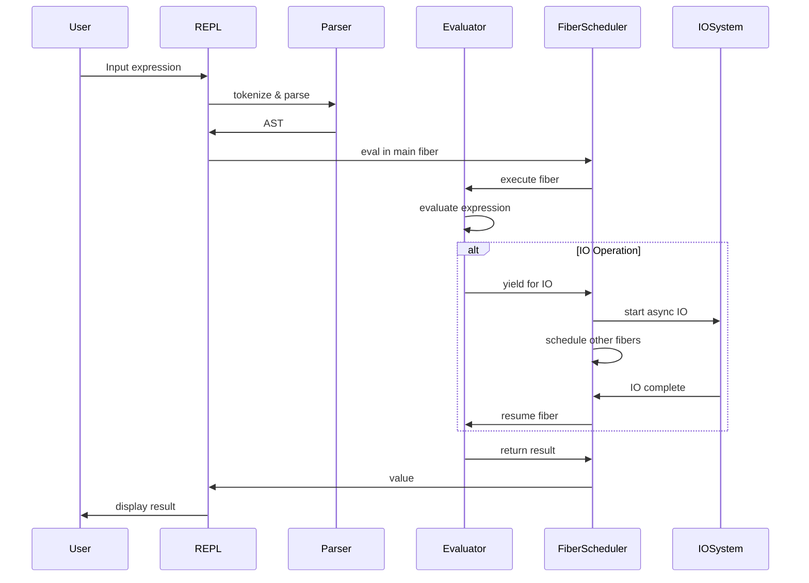
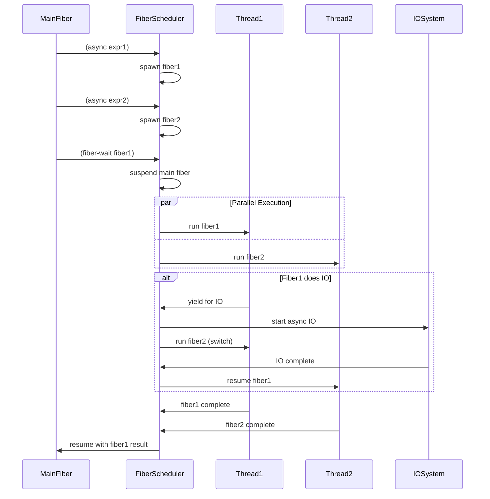
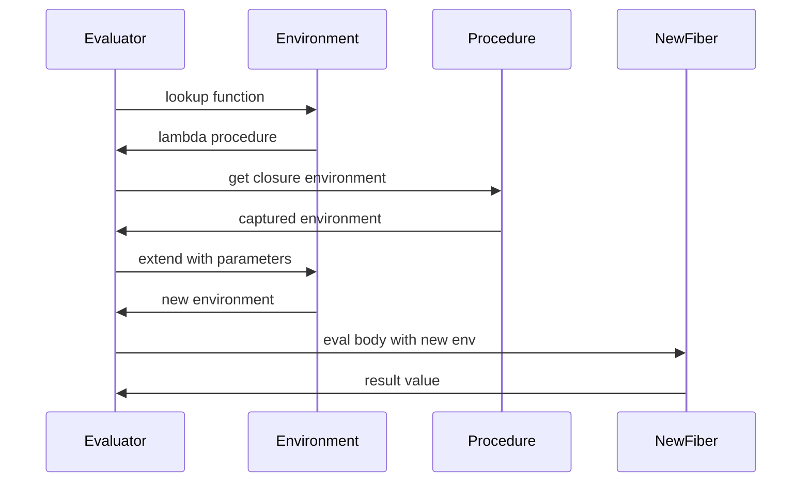

# Twine Scheme Interpreter - Technical Design Document

## Table of Contents

1. [System Overview](#system-overview)
2. [Architecture](#architecture)
3. [Core Components](#core-components)
4. [Concurrency Model](#concurrency-model)
5. [Data Types and Memory Management](#data-types-and-memory-management)
6. [Execution Engine](#execution-engine)
7. [Asynchronous I/O](#asynchronous-io)
8. [Error Handling](#error-handling)
9. [Sequence Diagrams](#sequence-diagrams)
10. [Implementation Considerations](#implementation-considerations)
11. [Performance Characteristics](#performance-characteristics)
12. [Security Considerations](#security-considerations)

## System Overview

Twine is a functional Scheme interpreter written in Rust that emphasizes asynchronous I/O, fiber-based concurrency, simplicity, and immutability. While the language supports side effects such as I/O operations, it maintains strict immutability of all data structures and prevents mutation of function inputs or global state. The system is built around four core principles:

1. **Fiber Scheduler and Async Task System**: Lightweight fiber management with high-level task abstraction executed on a thread pool using `smol` async runtime
2. **Asynchronous I/O**: All I/O operations are asynchronous with fiber yielding, appearing synchronous to Scheme code
3. **Immutability**: All data structures are immutable after creation
4. **Simplicity and Minimalism**: Essential R7RS-small subset for maintainability and reduced complexity

### Key Design Decisions

- **Runtime**: `smol` async runtime for lightweight, efficient concurrency
- **Concurrency Model**: Fiber-based parallelism without Global Interpreter Lock (GIL)
- **Memory Management**: Rust's ownership system + reference counting for shared immutable data
- **Thread Pool**: Multi-threaded execution pool managed by `smol`
- **Error Handling**: Result-based error propagation with async-compatible patterns
- **Side Effects**: Side effects (I/O, network) are permitted while maintaining data immutability

## Architecture

### High-Level System Architecture

```
┌─────────────────────────────────────────────────────────────────┐
│                        User Interface Layer                     │
├─────────────────────────────────────────────────────────────────┤
│  REPL Interface  │           File Execution                     │
├─────────────────────────────────────────────────────────────────┤
│                     Interpreter Core                            │
├─────────────────────────────────────────────────────────────────┤
│   Parser    │    Evaluator    │    Environment Manager          │
├─────────────────────────────────────────────────────────────────┤
│                   Fiber Execution Engine                        │
├─────────────────────────────────────────────────────────────────┤
│              Smol Async Runtime + Thread Pool                   │
├─────────────────────────────────────────────────────────────────┤
│        Immutable Data Types    │    Built-in Procedures         │
└─────────────────────────────────────────────────────────────────┘
```

### Module Structure

```
twine/
├── src/
│   ├── main.rs              # Entry point and CLI
│   ├── lib.rs               # Library root
│   ├── lexer/
│   │   ├── mod.rs           # Tokenization
│   │   └── token.rs         # Token definitions
│   ├── parser/
│   │   ├── mod.rs           # S-expression parsing
│   │   └── ast.rs           # Abstract syntax tree
│   ├── interpreter/
│   │   ├── mod.rs           # Evaluation engine
│   │   ├── environment.rs   # Variable binding
│   │   ├── procedures.rs    # Built-in functions
│   │   └── fiber.rs         # Fiber management
│   ├── types/
│   │   ├── mod.rs           # Core data types
│   │   ├── value.rs         # Scheme values
│   │   └── immutable.rs     # Immutable collections
│   ├── runtime/
│   │   ├── mod.rs           # Async runtime management
│   │   ├── executor.rs      # Fiber executor
│   │   └── io.rs            # Async I/O operations
│   ├── repl/
│   │   ├── mod.rs           # REPL implementation
│   │   └── prompt.rs        # User interaction
│   └── error/
│       ├── mod.rs           # Error types
│       └── reporting.rs     # Error formatting
```

## Core Components

### 1. Lexer (`lexer/`)

**Responsibility**: Convert source code into tokens

```rust
pub enum Token {
    LeftParen,
    RightParen,
    Quote,
    Number(f64),
    String(String),
    Symbol(String),
    Boolean(bool),
    EOF,
}

pub struct Lexer {
    input: String,
    position: usize,
    line: usize,
    column: usize,
}
```

**Key Features**:
- Line/column tracking for error reporting
- Comment handling (semicolon to end-of-line)
- Proper number parsing (integers and floats)
- String literal parsing with escape sequences

### 2. Parser (`parser/`)

**Responsibility**: Convert tokens into Abstract Syntax Tree

```rust
#[derive(Debug, Clone)]
pub enum Expr {
    Atom(Value),
    List(Vec<Expr>),
    Quote(Box<Expr>),
}

pub struct Parser {
    tokens: Vec<Token>,
    current: usize,
}
```

**Key Features**:
- S-expression parsing with proper nesting
- Quote syntax handling
- Syntax error detection and reporting
- AST construction for efficient evaluation

### 3. Value System (`types/`)

**Responsibility**: Immutable data type representation

```rust
#[derive(Debug, Clone)]
pub enum Value {
    Number(f64),
    Boolean(bool),
    String(Arc<str>),
    Symbol(Arc<str>),
    List(Arc<[Value]>),
    Procedure(Arc<Procedure>),
    TaskHandle(TaskId),
    Nil,
}

#[derive(Debug)]
pub enum Procedure {
    Builtin {
        name: String,
        func: fn(&[Value], &mut TaskScheduler, TaskId) -> Result<Value, Error>,
    },
    Lambda {
        params: Vec<String>,
        body: Expr,
        closure: Environment,
    },
}
```

**Key Features**:
- All values are immutable after creation
- Reference counting (`Arc`) for memory efficiency
- Built-in and user-defined procedure support
- Proper list representation (proper/improper)

### 4. Environment Management (`interpreter/environment.rs`)

**Responsibility**: Variable binding and lexical scoping

```rust
#[derive(Debug, Clone)]
pub struct Environment {
    bindings: Arc<HashMap<String, Value>>,
    parent: Option<Arc<Environment>>,
}

impl Environment {
    pub fn new() -> Self { /* ... */ }
    pub fn with_parent(parent: Arc<Environment>) -> Self { /* ... */ }
    pub fn define(&mut self, name: String, value: Value) { /* ... */ }
    pub fn lookup(&self, name: &str) -> Option<Value> { /* ... */ }
    pub fn extend(&self, params: &[String], args: &[Value]) -> Environment { /* ... */ }
}
```

**Key Features**:
- Immutable environment chains
- Lexical scoping implementation
- Closure capture support
- Thread-safe sharing via `Arc`

### 5. Fiber Scheduler and Task System (`runtime/`)

**Responsibility**: Manage fiber execution and provide async task abstraction for Scheme code

The runtime consists of two layers:
1. **Fiber Scheduler**: Low-level fiber management with automatic I/O yielding
2. **Async Task System**: High-level task abstraction built on fibers

#### Fiber Scheduler

```rust
pub struct Fiber {
    id: FiberId,
    state: FiberState,
    continuation: Pin<Box<dyn Future<Output = Result<Value, Error>> + Send>>,
    parent: Option<FiberId>, // Only used when fiber is associated with a task; fibers are independent by default
}

pub enum FiberState {
    Ready,
    Running,
    Suspended(SuspendReason),
    Completed(Result<Value, Error>),
}

pub enum SuspendReason {
    IoOperation(Pin<Box<dyn Future<Output = ()> + Send>>),
    WaitingForTask(TaskHandle),
    Yielded,
}

pub struct FiberScheduler {
    ready_queue: VecDeque<FiberId>,
    fibers: HashMap<FiberId, Fiber>,
    runtime: smol::Executor<'static>,
    thread_pool: Vec<std::thread::JoinHandle<()>>,
    main_fiber: FiberId,
}

impl FiberScheduler {
    pub fn new(thread_count: usize) -> Self { /* ... */ }
    pub fn spawn_fiber(&mut self, thunk: Value, parent: Option<FiberId>) -> FiberId { /* ... */ } // parent only set for task-associated fibers
    pub fn yield_for_io(&mut self, fiber_id: FiberId, io_op: impl Future<Output = ()> + Send + 'static) { /* ... */ }
    pub fn yield_current(&mut self) { /* ... */ }
    pub fn resume_fiber(&mut self, fiber_id: FiberId) { /* ... */ }
    pub fn run_scheduler(&mut self) { /* ... */ }
}
```

#### Async Task System

Built on top of fibers, tasks provide hierarchical execution with parent-child relationships. Note that the hierarchy exists at the task level - fibers themselves are independent by default and only become connected when running tasks:

```rust
pub struct Task {
    handle: TaskHandle,
    fiber_id: FiberId,
    parent_task: Option<TaskHandle>,
    child_tasks: HashSet<TaskHandle>,
    result: Option<Result<Value, Error>>,
}

pub struct TaskHandle {
    id: TaskId,
    // Internal reference to task in scheduler
}

impl TaskHandle {
    pub fn wait(&self, scheduler: &mut FiberScheduler) -> Result<Value, Error> { /* ... */ }
    pub fn is_finished(&self) -> bool { /* ... */ }
    pub fn cancel(&self, scheduler: &mut FiberScheduler) { /* ... */ }
}
```

**Key Features**:
- **Main Fiber**: All execution starts in a single main fiber
- **Transparent I/O**: I/O operations automatically yield without explicit syntax
- **Task Hierarchy**: Parent-child relationships for resource management
- **Task Abstraction**: High-level async tasks for Scheme programmers
- **Automatic Cleanup**: Child tasks terminated when parent completes
- **Synchronous Semantics**: All operations appear synchronous to Scheme code
- **True Parallelism**: Thread pool enables multi-core execution without GIL

**Important Distinction**: Fibers are independent execution units by default. The hierarchy and parent-child relationships exist at the **task level**, not the fiber level. Fibers only become connected when they are associated with tasks that have hierarchical relationships.

## Concurrency Model

The Twine interpreter uses a fiber-based concurrency model built around a central fiber scheduler. All code execution occurs within fibers, with the interpreter starting execution in a single main fiber. The fiber scheduler manages the execution of multiple fibers, yielding control between them when fibers perform I/O operations or explicitly yield control.

### Fiber Scheduler Architecture

The concurrency model is built around a fiber scheduler with two layers:

**1. Fiber Scheduler (Low-level)**
- Manages fiber execution and yielding
- Handles I/O suspension automatically
- Coordinates with thread pool for parallelism

**2. Async Task System (High-level)**
- Provides task abstraction for Scheme code
- Manages parent-child task relationships
- Built on top of fiber scheduler

```
┌─────────────────────────────────────────────────────────────┐
│                    Async Task Layer                         │
│  ┌─────────────┐  ┌─────────────────────────────────────┐   │
│  │ Task Tree   │  │ async/task-wait Builtins            │   │
│  │ Main        │  │ - spawn tasks                       │   │
│  │ ├─Task A    │  │ - wait for completion               │   │
│  │ ├─Task B    │  │ - hierarchical cleanup              │   │
│  │ └─Task C    │  │                                     │   │
│  └─────────────┘  └─────────────────────────────────────┘   │
├─────────────────────────────────────────────────────────────┤
│                   Fiber Scheduler                           │
│  ┌─────────────┐  ┌─────────────┐  ┌─────────────┐         │
│  │ Ready Queue │  │ Suspended   │  │ Main Fiber  │         │
│  │ [F1, F3]    │  │ [F2→IO]     │  │ [running]   │         │
│  └─────────────┘  └─────────────┘  └─────────────┘         │
├─────────────────────────────────────────────────────────────┤
│                    Smol Async Runtime                       │
├─────────────────────────────────────────────────────────────┤
│  Thread 1    │  Thread 2    │  Thread 3    │  Thread 4    │
│  Running     │  Running     │  Running     │  Running     │
│  Task A      │  Task C      │  Task E      │  (idle)      │
│  (Fiber)     │  (Fiber)     │  (Fiber)     │              │
└─────────────────────────────────────────────────────────────┘
```

**Fiber Scheduling Process**:
1. All code starts in the main fiber
2. `spawn-fiber` creates independent fibers
3. `async` builtin creates hierarchical tasks (built on fibers)
4. I/O operations automatically yield current fiber to scheduler
5. Scheduler selects next ready fiber for execution
6. I/O completion moves fiber back to ready queue
7. Parent task completion triggers child task termination

### Fiber and Task Lifecycle

#### Fiber Lifecycle (Low-level)
1. **Creation**: Fibers spawned via `spawn-fiber` or internally by async tasks
2. **Ready**: Fiber added to scheduler's ready queue
3. **Running**: Fiber executes on thread from thread pool
4. **Suspended**: Fiber yields due to I/O or explicit yield
5. **Resumption**: Fiber moved back to ready queue when I/O completes
6. **Completion**: Fiber finishes execution and is cleaned up

#### Task Lifecycle (High-level)
1. **Creation**: Tasks spawned via `async` builtin, immediately start executing
2. **Parent Linking**: Task linked to current task as parent-child relationship
3. **Execution**: Task runs synchronously from Scheme perspective
4. **Waiting**: Other tasks can `task-wait` for completion
5. **Completion**: Task finishes and notifies any waiting tasks
6. **Cleanup**: Child tasks terminated when parent completes

**Key Differences**:
- **Fibers**: Independent execution units with manual lifecycle management
- **Tasks**: Hierarchical execution with automatic parent-child cleanup
- **I/O Handling**: Both automatically yield on I/O, appear synchronous to code
6. **Synchronization**: `task-wait` suspends current task until target completes
7. **Completion**: Task completes with result value

**Task States**:
- **Ready**: Waiting in scheduler queue for execution
- **Running**: Currently executing on a thread (backed by fiber)
- **Suspended**: Waiting for IO or other task completion
- **Completed**: Finished with result value

### Thread Safety

- **Immutable Data**: All Scheme values are immutable, enabling safe sharing
- **Arc-based Sharing**: Reference counting for memory management
- **No Locks**: Immutability eliminates need for mutexes or locks
- **Message Passing**: Tasks communicate through immutable value passing

## Data Types and Memory Management

### Immutable Value Design

All Scheme values are designed for complete immutability:

```rust
// Numbers and booleans are Copy types (immutable by nature)
pub type SchemeNumber = f64;
pub type SchemeBoolean = bool;

// Strings and symbols use Arc<str> for efficient sharing
pub type SchemeString = Arc<str>;
pub type SchemeSymbol = Arc<str>;

// Lists use Arc<[Value]> for immutable arrays
pub type SchemeList = Arc<[Value]>;

// Procedures are wrapped in Arc for sharing
pub type SchemeProcedure = Arc<Procedure>;
```

### Memory Management Strategy

1. **Stack Allocation**: Small values (numbers, booleans) on stack
2. **Heap Allocation**: Strings, lists, procedures on heap with reference counting
3. **Automatic Cleanup**: Rust's ownership system handles deallocation
4. **Sharing Optimization**: `Arc` enables efficient sharing across fibers
5. **No GC Overhead**: No traditional garbage collector needed

### List Operations and Structural Sharing

Lists maintain immutability through structural sharing:

```
Original:     [1, 2, 3, 4]
              └─Arc─┘

Cons 0:       [0, 1, 2, 3, 4]
              │   └─Arc (shared)─┘
              └─New Arc─┘

Car/Cdr operations create new views without copying data.
```

## Execution Engine

### Evaluation Model

The evaluator follows a standard Scheme evaluation model adapted for async execution:

```rust
pub fn eval(expr: Expr, env: Environment, scheduler: &mut TaskScheduler, task_id: TaskId) -> Result<Value, Error> {
    match expr {
        Expr::Atom(value) => eval_atom(value, env, scheduler, task_id),
        Expr::List(exprs) => eval_list(exprs, env, scheduler, task_id),
        Expr::Quote(expr) => eval_quote(*expr, env, scheduler, task_id),
    }
}

fn eval_list(exprs: Vec<Expr>, env: Environment, scheduler: &mut TaskScheduler, task_id: TaskId) -> Result<Value, Error> {
    if exprs.is_empty() {
        return Ok(Value::Nil);
    }

    let first = &exprs[0];
    match first {
        // Special forms
        Expr::Atom(Value::Symbol(sym)) if sym.as_ref() == "if" => {
            eval_if(&exprs[1..], env, scheduler, task_id)
        }
        Expr::Atom(Value::Symbol(sym)) if sym.as_ref() == "define" => {
            eval_define(&exprs[1..], env, scheduler, task_id)
        }
        Expr::Atom(Value::Symbol(sym)) if sym.as_ref() == "lambda" => {
            eval_lambda(&exprs[1..], env, scheduler, task_id)
        }
        // Function application
        _ => eval_application(exprs, env, scheduler, task_id),
    }
}
```

### Tail Call Optimization

Implemented through async recursion and proper future handling:

```rust
fn eval_application(exprs: Vec<Expr>, env: Environment, scheduler: &mut TaskScheduler, task_id: TaskId) -> Result<Value, Error> {
    let func = eval(exprs[0].clone(), env.clone(), scheduler, task_id)?;
    let args = eval_args(&exprs[1..], env.clone(), scheduler, task_id)?;

    match func {
        Value::Procedure(proc) => {
            match proc.as_ref() {
                Procedure::Lambda { params, body, closure } => {
                    let new_env = closure.extend(params, &args);
                    // Tail call optimization through direct recursion
                    eval(body.clone(), new_env, scheduler, fiber_id)
                }
                Procedure::Builtin { func, .. } => {
                    func(&args, scheduler, fiber_id)
                }
            }
        }
        _ => Err(Error::TypeError("Not a procedure".to_string())),
    }
}

fn eval_args(exprs: &[Expr], env: Environment, scheduler: &mut FiberScheduler, fiber_id: FiberId) -> Result<Vec<Value>, Error> {
    let mut args = Vec::new();
    for expr in exprs {
        args.push(eval(expr.clone(), env.clone(), scheduler, fiber_id)?);
    }
    Ok(args)
}
```

## Asynchronous I/O and Fiber Integration

### I/O Architecture

All I/O operations in Twine are asynchronous at the runtime level but appear completely synchronous to Scheme code. When a fiber performs an I/O operation, it automatically yields execution to the fiber scheduler, which then runs other fibers while the I/O operation completes in the background.

**Fiber-Integrated I/O Principles:**
- **Transparent Yielding**: I/O operations automatically yield the current fiber without explicit syntax
- **Synchronous Appearance**: No async/await syntax - I/O looks like regular function calls
- **Non-blocking Runtime**: Other fibers continue execution while I/O happens
- **Automatic Resumption**: Fibers resume automatically when I/O completes
- **Scheduler Coordination**: All I/O operations coordinate with the central fiber scheduler

```rust
pub mod io {
    use smol::io::{AsyncWriteExt, AsyncBufReadExt};

    // Internal async implementation
    async fn display_async(value: &Value) -> Result<(), Error> {
        let output = format_value(value);
        let mut stdout = smol::io::stdout();
        stdout.write_all(output.as_bytes()).await
            .map_err(|e| Error::IoError(e.to_string()))?;
        stdout.flush().await
            .map_err(|e| Error::IoError(e.to_string()))?;
        Ok(())
    }

    // Fiber-yielding wrapper - appears synchronous to Scheme
    pub fn display(value: &Value, scheduler: &mut FiberScheduler, fiber_id: FiberId) -> Result<(), Error> {
        let io_future = display_async(value);
        scheduler.yield_for_io(fiber_id, Box::pin(async {
            io_future.await.unwrap();
        }));
        // Execution resumes here after IO completes
        Ok(())
    }

    pub fn read_line(scheduler: &mut FiberScheduler, fiber_id: FiberId) -> Result<String, Error> {
        let (sender, receiver) = async_channel::bounded(1);
        let io_future = async move {
            let stdin = smol::io::stdin();
            let mut reader = smol::io::BufReader::new(stdin);
            let mut line = String::new();
            let result = reader.read_line(&mut line).await
                .map(|_| line.trim().to_string())
                .map_err(|e| Error::IoError(e.to_string()));
            sender.send(result).await.unwrap();
        };
        scheduler.yield_for_io(fiber_id, Box::pin(io_future));
        // Execution resumes here with result
        receiver.recv_blocking().unwrap()
    }
}
```

**Key Principles**:
- IO operations yield fiber execution to scheduler
- Fibers resume automatically when IO completes
- From Scheme perspective, IO appears synchronous
- No async/await syntax needed in Scheme code

### Built-in Fiber and Task Procedures

Built-in procedures integrate with the fiber scheduler for transparent I/O and task management:

```rust
pub fn create_builtin_procedures() -> HashMap<String, Procedure> {
    let mut builtins = HashMap::new();

    // I/O operations that automatically yield
    builtins.insert("display".to_string(), Procedure::Builtin {
        name: "display".to_string(),
        func: |args, scheduler, fiber_id| {
            if args.len() != 1 {
                return Err(Error::ArityError("display expects 1 argument".to_string()));
            }
            io::display(&args[0], scheduler, fiber_id)?;
            Ok(Value::Nil)
        },
    });

    // Low-level fiber spawning (independent execution)
    builtins.insert("spawn-fiber".to_string(), Procedure::Builtin {
        name: "spawn-fiber".to_string(),
        func: |args, scheduler, _fiber_id| {
            if args.len() != 1 {
                return Err(Error::ArityError("spawn-fiber expects 1 argument".to_string()));
            }
            let fiber_id = scheduler.spawn_fiber(args[0].clone(), None);
            Ok(Value::FiberHandle(fiber_id))
        },
    });

    // High-level task spawning (hierarchical with parent-child relationship)
    builtins.insert("async".to_string(), Procedure::Builtin {
        name: "async".to_string(),
        func: |args, scheduler, current_fiber_id| {
            if args.len() != 1 {
                return Err(Error::ArityError("async expects 1 argument".to_string()));
            }
            // Create task linked to current task as parent
            let task_handle = scheduler.spawn_task(args[0].clone(), Some(current_fiber_id));
            Ok(Value::TaskHandle(task_handle))
        },
    });

    // Wait for task completion (hierarchical tasks)
    builtins.insert("task-wait".to_string(), Procedure::Builtin {
        name: "task-wait".to_string(),
        func: |args, scheduler, fiber_id| {
            if args.len() != 1 {
                return Err(Error::ArityError("task-wait expects 1 argument".to_string()));
            }
            if let Value::TaskHandle(task_handle) = &args[0] {
                // Suspend current fiber until task completes
                task_handle.wait(scheduler, fiber_id)
            } else {
                Err(Error::TypeError("task-wait requires a task handle".to_string()))
            }
        },
    });

    // Wait for fiber completion (low-level)
    builtins.insert("fiber-wait".to_string(), Procedure::Builtin {
        name: "fiber-wait".to_string(),
        func: |args, scheduler, fiber_id| {
            if args.len() != 1 {
                return Err(Error::ArityError("fiber-wait expects 1 argument".to_string()));
            }
            if let Value::FiberHandle(target_fiber) = &args[0] {
                scheduler.wait_for_fiber(fiber_id, *target_fiber);
                // Current fiber suspended until target completes
                Ok(scheduler.get_fiber_result(*target_fiber))
            } else {
                Err(Error::TypeError("Expected fiber handle".to_string()))
            }
        },
    });

    builtins
}
```

## Error Handling

### Error Type Hierarchy

```rust
#[derive(Debug, Clone)]
pub enum Error {
    // Parsing errors
    SyntaxError { message: String, line: usize, column: usize },
    ParseError(String),

    // Runtime errors
    TypeError(String),
    ArityError(String),
    UnboundVariable(String),

    // I/O errors
    IoError(String),

    // Fiber errors
    FiberError(String),

    // System errors
    SystemError(String),
}

impl std::fmt::Display for Error {
    fn fmt(&self, f: &mut std::fmt::Formatter<'_>) -> std::fmt::Result {
        match self {
            Error::SyntaxError { message, line, column } => {
                write!(f, "Syntax error at line {}, column {}: {}", line, column, message)
            }
            Error::TypeError(msg) => write!(f, "Type error: {}", msg),
            Error::ArityError(msg) => write!(f, "Arity error: {}", msg),
            Error::UnboundVariable(var) => write!(f, "Unbound variable: {}", var),
            Error::IoError(msg) => write!(f, "I/O error: {}", msg),
            Error::FiberError(msg) => write!(f, "Fiber error: {}", msg),
            Error::SystemError(msg) => write!(f, "System error: {}", msg),
            _ => write!(f, "{:?}", self),
        }
    }
}
```

### Error Propagation in Async Context

```rust
pub type Result<T> = std::result::Result<T, Error>;

// Error handling in fiber execution
pub async fn execute_safely<F, T>(future: F) -> Result<T>
where
    F: Future<Output = Result<T>>,
{
    match future.await {
        Ok(value) => Ok(value),
        Err(error) => {
            eprintln!("Error: {}", error);
            Err(error)
        }
    }
}
```

## Sequence Diagrams

### REPL Execution Flow



### Parallel Fiber Execution



### Function Application with Closure



## Implementation Considerations

### Dependencies

```toml
[dependencies]
smol = "2.0"
futures = "0.3"
async-channel = "2.0"
arc-swap = "1.6"
thiserror = "1.0"
clap = "4.0"
```

### Performance Optimizations

1. **Intern String/Symbols**: Use string interning for symbols to reduce memory usage
2. **Tail Call Optimization**: Implement proper tail calls through async recursion
3. **Structural Sharing**: Maximize sharing of immutable data structures
4. **Lazy Evaluation**: Implement lazy sequences where beneficial
5. **Batch I/O**: Group I/O operations for efficiency

### Memory Considerations

- **Arc Overhead**: Monitor reference counting overhead for small values
- **Stack Depth**: Manage async recursion stack depth
- **Fiber Memory**: Track memory usage per fiber
- **Environment Chains**: Optimize environment lookups

### Testing Strategy

```rust
#[cfg(test)]
mod tests {
    use super::*;

    #[test]
    fn test_basic_arithmetic() {
        let mut scheduler = FiberScheduler::new(1);
        let result = eval_string("(+ 1 2 3)", &mut scheduler).unwrap();
        assert_eq!(result, Value::Number(6.0));
    }

    #[test]
    fn test_fiber_execution() {
        let mut scheduler = FiberScheduler::new(4);
        let fiber1 = scheduler.spawn_fiber_from_string("(+ 1 1)");
        let fiber2 = scheduler.spawn_fiber_from_string("(* 2 2)");
        let fiber3 = scheduler.spawn_fiber_from_string("(- 5 2)");

        scheduler.run_scheduler();

        assert_eq!(scheduler.get_fiber_result(fiber1), Ok(Value::Number(2.0)));
        assert_eq!(scheduler.get_fiber_result(fiber2), Ok(Value::Number(4.0)));
        assert_eq!(scheduler.get_fiber_result(fiber3), Ok(Value::Number(3.0)));
    }
}
```

## Performance Characteristics

### Expected Performance

- **Simple Arithmetic**: < 1ms per operation
- **Function Calls**: < 10μs overhead per call
- **Fiber Creation**: < 100μs per fiber
- **Memory Usage**: ~1KB per active fiber
- **Thread Scaling**: Linear scaling up to CPU core count

### Benchmarking Areas

1. **Recursive Functions**: Fibonacci, factorial with tail call optimization
2. **List Operations**: Large list creation and manipulation
3. **Parallel Execution**: CPU-bound tasks across multiple cores
4. **I/O Performance**: Async I/O throughput and latency
5. **Memory Usage**: Memory consumption under various workloads

## Security Considerations

### Memory Safety

- **No Buffer Overflows**: Rust's memory safety prevents buffer overflows
- **No Use-After-Free**: Ownership system prevents use-after-free bugs
- **No Data Races**: Immutability eliminates data race conditions
- **Controlled Resource Access**: No direct system call access

### Resource Limits

```rust
pub struct ResourceLimits {
    max_stack_depth: usize,
    max_fiber_count: usize,
    max_memory_usage: usize,
    execution_timeout: Duration,
}

impl ResourceLimits {
    pub fn check_stack_depth(&self, depth: usize) -> Result<(), Error> {
        if depth > self.max_stack_depth {
            Err(Error::SystemError("Stack overflow".to_string()))
        } else {
            Ok(())
        }
    }
}
```

### Sandboxing

- **No File System Access**: Only controlled I/O through built-in procedures
- **No Network Access**: No built-in network operations
- **No System Calls**: No direct operating system interaction
- **Controlled Execution**: Resource limits prevent denial of service

## Future Considerations

### Potential Extensions

1. **Module System**: Simplified module loading and namespacing
2. **Debugging Support**: Basic debugging facilities
3. **Profiling**: Performance profiling tools
4. **FFI**: Foreign function interface for C library integration
5. **Serialization**: Scheme value serialization/deserialization

### Scalability Improvements

- **Work Stealing**: Implement work-stealing scheduler for better load balancing
- **NUMA Awareness**: Optimize for NUMA architectures
- **Memory Pooling**: Custom memory allocators for performance
- **JIT Compilation**: Just-in-time compilation for hot code paths

This design document provides the foundation for implementing the Twine Scheme interpreter with the specified requirements for immutability, async I/O, and parallel fiber execution using the `smol` runtime.
